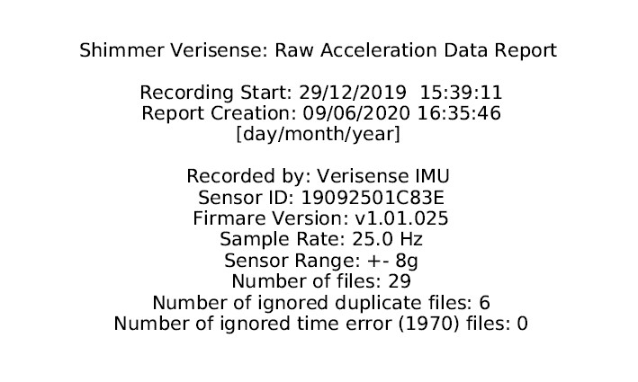
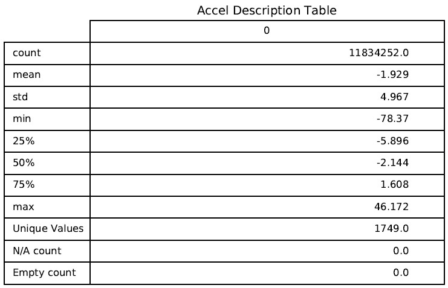
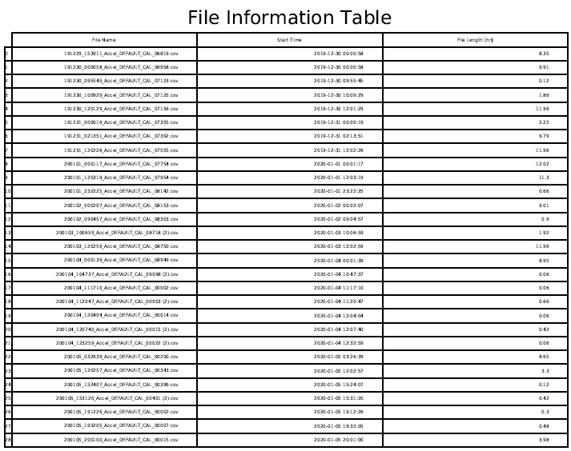
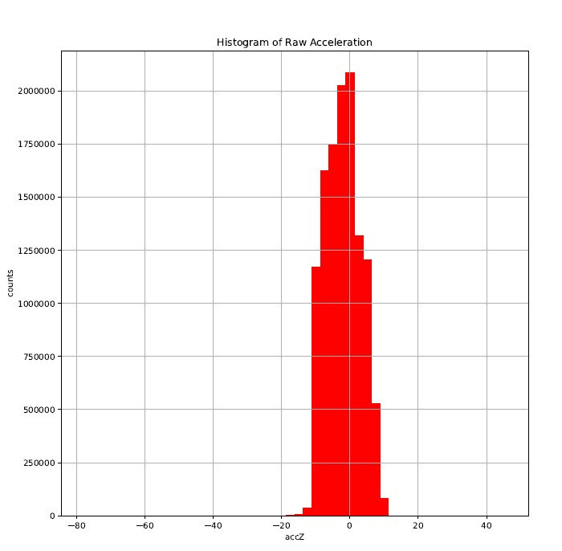
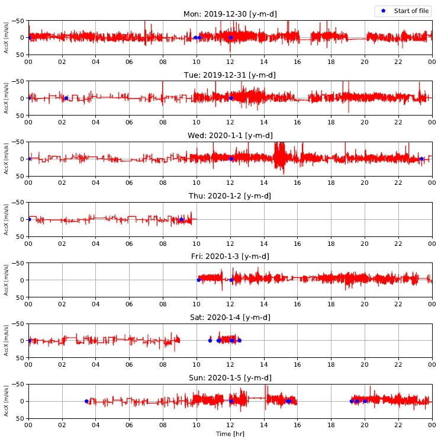

## Verisense Raw Data Visualization Tool

This is a python tool for Windows that can be run from the command line to create visualizations in pdf files of a folder of raw Verisense (.csv) recordings. A separate pdf file will be created for each week of raw data. After running the tool, pdf files can be found in the 'Verisense_Raw_Acc_QC' folder inside the folder with the raw data that is being analyzed.

There is a separate tool for viewing raw gyroscope data from Verisense. It is run the same way as the accel data viewer, it just has a different name and creates a folder called 'Verisense_Raw_Gyro_QC' in which the pdf reports will be generated.

### Instructions

- cmd window
- go to folder containing the .py file
- type 'python Verisense_Raw_Acc_Report.py' in cmd window to view acceleration data
- if gyroscope data is available, type 'python Verisense_Raw_Gyro_Report.py' in cmd window to view gyro data
- then enter path to folder (using either '/' or '\\') in cmd window
- pdf reports(s) will be created in path folder with visualizations

### Dependencies
- python (64-bit)
- following python packages:
	- numpy, pandas, matplotlib and pathlib
  - 'python -m pip install numpy' to install

### Notes
- The tool will take into account different sampling rates
- One of the three acceleration (or gyroscope) channels is plotted in order to reduce processing time

### Example Output
For each week (Mon - Sun) that contains data a separate pdf report is generated. This is what it looks like.
#### Title Page:

#### Accel Description Table:

#### File Information Table:

#### Histogram

#### Raw Data

